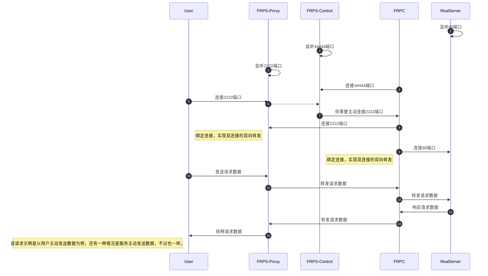

[Documentation | Eclipse Vert.x](https://vertx.io/docs/)

案例说明

* Example1.java：vertx执行阻塞逻辑、事件回调逻辑、定时任务注册与取消，以及verticle和事件总线。
* Example2.java：vertx组建集群，以及集群事件总线的使用。
* Example3.java：vertx使用httpclient。通过1个线程，在10秒内完成对2000个耗时10秒的HTTP请求。
* Example4.java：http server
* Example5.java：vertx中提供的文件系统。
* Example6.java：vertx实现http反向代理，使用默认处理逻辑与自定义处理逻辑。
* Example7.java：vertx实现tcp服务，使用handler函数式接口，并记录使用中碰到的错误点。
* Example8.java：vertx实现tcp反向代理。该代码来自于vertx-sql-client。
* Example9.java：vertx实现http数据传输，并以tomcat为例解决实现上传时的一些[疑问](https://juejin.cn/post/7055851941837930533)。
* Example10.java：vertx实现tcp数据传输，并验证tcp双端产生和消费速率不匹配时的一些问题。
* Example11.java：vertx使用webclient
* Example12.java：vertx使用protobuf封装tcp通信机制，自定义协议消息结构（消息长度+消息类型+可变消息体）解决粘包/半包问题。
* Example13.java：vertx的RecordParser以及基于自定义消息结构实现解码逻辑
* Example14.java：vertx实现tcp client的自动重连机制
* Example15.java：理解socket.resume简易示例
* Example16.java：手撕frp简易功能，该内容在下文有mermaid时序图。

`Example16.java` 时序图

